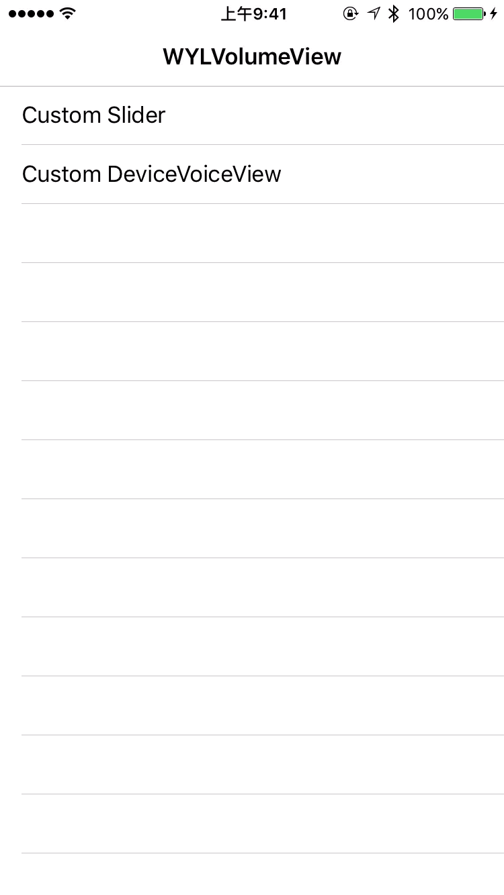

# WYLVolumeManager
帮助开发者自定义iPhone系统音量view的类



# Getting Started
**Using [CocoaPods](http://cocoapods.org)**
 
 1.Add the pod `WYLVolumeManager` to your [Podfile](http://guides.cocoapods.org/using/the-podfile.html).
```ruby
pod 'WYLVolumeManager', '~> 1.0.1'
```

 2.Run `pod install` from Terminal, then open your app's `.xcworkspace` file to launch Xcode.
 
 3.`#import WYLVolumeManager.h` wherever you want to use the API.
 
 **Manually from GitHub**

1.Download the `WYLVolumeManager.h` and `WYLVolumeManager.m` files in th [Source directory](https://github.com/wangyanlong/WYLVolumeManager/tree/master/WYLVolumeManagerFile)

2.Add both files to your Xcode project.

3.`#import WYLVolumeManager.h` wherever you want to use the API.

#Example Usage

**Example location**

Check out the [example project](https://github.com/wangyanlong/WYLVolumeManager) included in the repository. It contains a few demos of the API in use for various scenarios. 

**Usage**

no.1 Included WYLVolumeManager.h in your project

no.2 configure WYLVolumeManager like this.

	manager = [[WYLVolumeManager alloc]init];
    manager.delegate = self;
    [manager configureVolumeManagerWithParentView:self.view hiddenDeviceVolumeView:YES]; 

no.3 Overlay system "touchBegin","touchesMoved","touchesEnd" method like this

	- (void)touchesBegan:(NSSet *)touches withEvent:(UIEvent *)event{
    
    [manager touchBegin:event withTouchView:self.view];
    
	}

	- (void)touchesMoved:(NSSet *)touches withEvent:(UIEvent *)event{
    
    WYLVolumeSlider *slider1 = (WYLVolumeSlider *)[self.view viewWithTag:1000];
    
    __weak __block WYLVolumeManager *_manager = manager;
    
    [_manager touchMove:event withTouchView:self.view withTouchBlock:^(float num) {
        slider1.value += num;
        _manager.volume.value = slider1.value;
    }];
    
	}

	- (void)touchesEnded:(NSSet *)touches withEvent:(UIEvent *)event{
    [manager touchEnd];
	}
 

no.4 Delegate method like this


	- (void)systemVolumeDidChange:(CGFloat)value{
    
    WYLVolumeSlider *slider1 = (WYLVolumeSlider *)[self.view viewWithTag:1000];
    slider1.value = value;
    
	}


#License
MIT